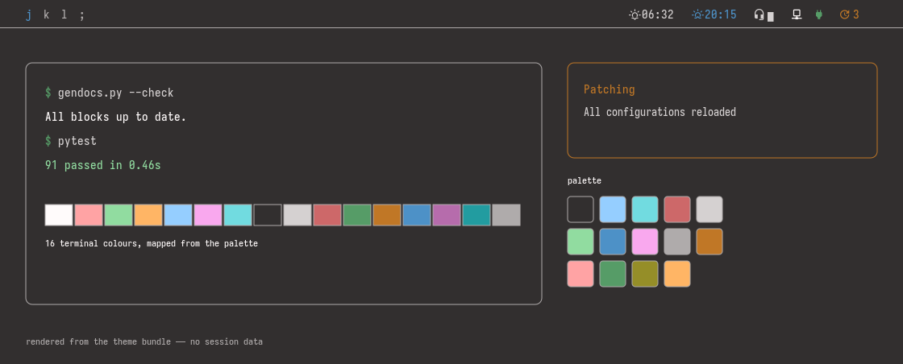

# Dot Files

A complete Arch Linux desktop: qtile with a status bar that reads live system metrics, a
themed login screen and boot splash, and a colour palette that every application derives
from and that follows sunrise and sunset.



<!-- BEGIN: CONFIGURED -->
*Generated by `helper/gendocs.py` — edits between the markers are overwritten. Change the source it reads from instead.*

The bar, the terminal, the launcher and the notifications above are drawn from the `default` theme in `Iosevka NF` — the same palette every application below receives.

| Application | Installed to | For |
|---|---|---|
| bash | `~/.bashrc` | shell |
| dircolors | `~/.dircolors` | `ls` colours |
| xorg | `~/.xinitrc` | session startup and DPI |
| icc | `~/.config/icc` | display colour profiles |
| vim | `~/.vimrc` | editor |
| starship | `~/.config/starship.toml` | shell prompt |
| qtile | `~/.config/qtile` | window manager and bar |
| picom | `~/.config/picom` | compositor |
| tmux | `~/.config/tmux` | terminal multiplexer |
| kitty | `~/.config/kitty` | terminal |
| dunst | `~/.config/dunst` | notifications |
| rofi | `~/.config/rofi` | launcher |
| qutebrowser | `~/.config/qutebrowser/config.py` | browser |
| mpv | `~/.config/mpv` | video |
| Visual Studio Code settings | `~/.config/Code/User/settings.json` | editor |
<!-- END: CONFIGURED -->

The same, [in light](docs/preview/light.png). Both are rendered from the theme bundle rather
than captured from a running session, so they show the configuration and nothing that was on
anyone's screen — regenerate them with `python helper/render_preview.py` after changing the
default theme.

## Is This For You

It is worth installing if you run Arch, want a keyboard-driven tiling desktop, and would
rather adopt a coherent one than assemble it. It is worth reading either way — the palette
system and the patchers are the interesting parts, and they are documented on their own.

**What it assumes.** Arch Linux with an X session. A Nerd Font, because the bar draws
private-use glyphs. Optionally an [IPinfo](https://ipinfo.io/) token, without which the
automatic light/dark switch has no sunrise to switch at, and
[yths.backend-service](https://github.com/yths/yths.backend-service), without which the bar
renders but stays empty.

**What it replaces.** Your configuration for qtile, kitty, rofi, dunst, picom, tmux,
starship, mpv, vim, qutebrowser and VSCode. Anything already at one of those paths is
renamed to `*.<timestamp>.bak` first, so nothing is lost, but it stops being what runs.

**How it replaces them.** With symlinks into the clone, not copies. The installed
configuration *is* this repository: editing `~/.config/qtile/config.py` edits the clone, and
deleting the clone takes the desktop with it. That is deliberate — it is what lets a theme
switch rewrite every application at once — but it means the clone is not disposable.

## Install

```bash
git clone https://github.com/yths/yths.dot-files.git
cd yths.dot-files
./bootstrap.sh
```

That installs the packages, the configuration and a theme. `./bootstrap.sh --dry-run` prints
what it would do and stops; `--dev` adds the linter and test runner.

Everything you would change first is in [setup.toml](setup.toml) — the theme, the font, the
package list, which credentials to collect. Edit it before running, and nothing else needs
touching.

Two steps stay manual because each needs root and a decision:
[the boot splash](configuration/plymouth/README.md) and
[the login screen](configuration/web-greeter/README.md).

Starting from a bare disk instead: [docs/os-build.md](docs/os-build.md).

## Documentation

- [docs/install.md](docs/install.md) — the long form of the above, one step at a time
- [docs/os-build.md](docs/os-build.md) — building the base Arch system from a blank disk
- [docs/architecture.md](docs/architecture.md) — how the pieces fit: bundles, installer, patchers, widgets, backend contract
- [docs/notes.md](docs/notes.md) — the theme system, the widget architecture, the yths.themes contract
- [docs/config-schema.md](docs/config-schema.md) — `~/.config/config.json`, which every component reads
- [docs/palette-semantics.md](docs/palette-semantics.md) — what each palette token means, and the contract a preset must honour
- [docs/palette-reference.md](docs/palette-reference.md) — generated: where each token is used, and which tools still hardcode hex
- [docs/palettes/](docs/palettes/) — what each token looks like, one swatch reference per preset
- [docs/keybindings.md](docs/keybindings.md) — generated: every keyboard binding, grouped by tool
- [docs/dependencies.md](docs/dependencies.md) — generated: every import mapped to the Arch package providing it
- [docs/tips.md](docs/tips.md) — recipes for theme switching, previewing, debugging
- [docs/issues.md](docs/issues.md) — open and closed work
- [docs/style.md](docs/style.md) — how these documents are written

Changing anything here: [CONTRIBUTING.md](CONTRIBUTING.md).

## License

MIT, see [LICENSE.md](LICENSE.md).
